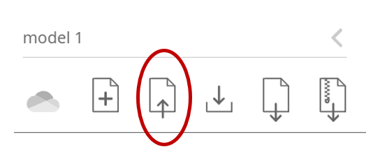

# Executable Network of SARS-CoV-2-Host Interaction Predicts Drug Combination Treatments

## Overview

Network model `.json` file for the SARS-CoV-2 Host Interaction Model first described in [Howell, Clarke, Reuschl et al., *npj Digit. Med.* 2022](https://www.nature.com/articles/s41746-022-00561-5). 

This network model allows rapid profiling of potential single and combination treatments by their effect on 8 key COVID-19 symptoms. This model is a Qualitative Network (QN), built and analysed using [Bio Model Analyzer](https://biomodelanalyzer.org) (BMA).

## Instructions

The `.json` file for the network can be used to explore SARS-CoV-2 host interaction in the [Bio Model Analyzer](https://biomodelanalyzer.org) (BMA) tool. To import the network JSON file, use the "Import" button in the left hand tooltab. 

The model can also be explored using a local installation of [BMA](https://github.com/hallba/BioModelAnalyzer). BMA can currently only be built on Windows. 

## Citing

Please cite this work as: 

Howell, R., Clarke, M.A., Reuschl, AK. et al. Executable network of SARS-CoV-2-host interaction predicts drug combination treatments. *npj Digit. Med.* **5**, 18 (2022). https://doi.org/10.1038/s41746-022-00561-5.

## License

This project is licensed under the MIT License - see the [LICENSE](LICENSE) file for details.
